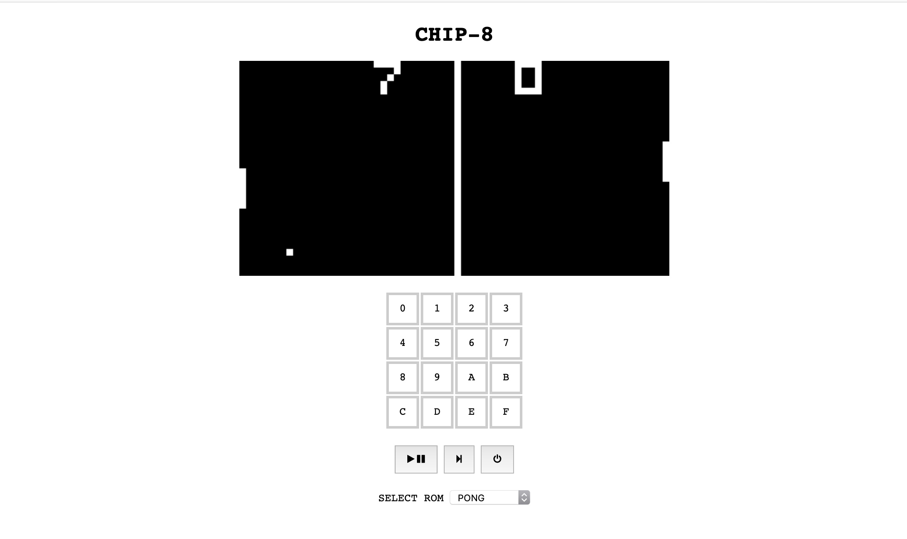

# CHIP 8 Emulator in Web Assembly and Rust

## Installation
- Build Wasm package with `wasm-pack build`
- CD into `frontend` and install packages
- run the server with `npm start`. Emulator should be up on localhost:8080
